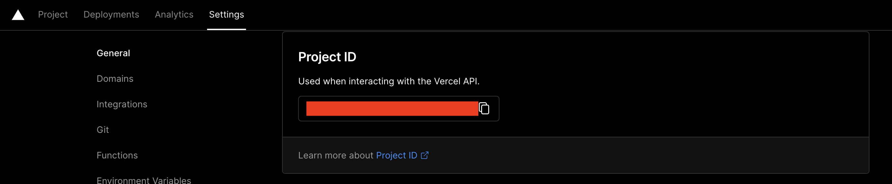
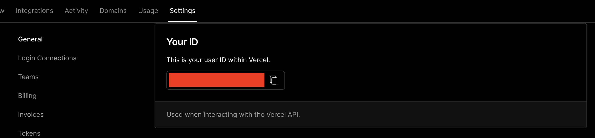
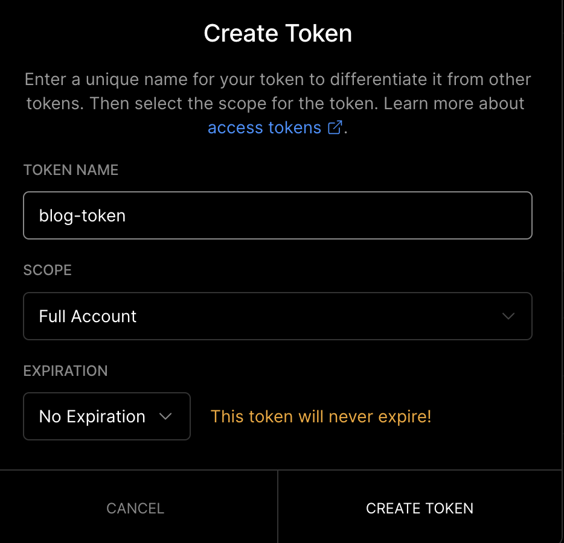

1. Go to your Project settings, you'll want to copy the project id (Project Settings > General > Project Id). Save this for later.
   
1. Then go your account id ([Personal Account Settings](https://vercel.com/account) > General > Your ID). Save this for later as well.
   
1. Finally, generate a token under ([Personal Account Settings](https://vercel.com/account) > Tokens > Create). Finally save the value of the token for the next step.
   
