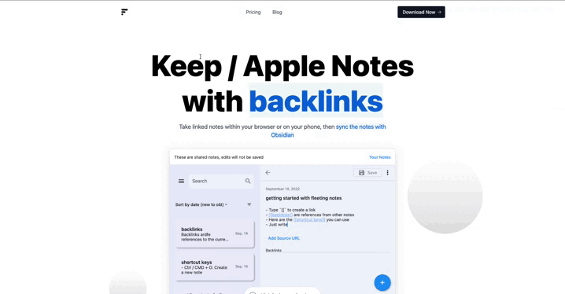

## Problems with Obsidian Publish Alternatives (from ChatGPT):

 > 
 > **Compatibility**: Not all Obsidian Publish alternatives may be compatible with all versions of Obsidian or all markdown syntax, which can make it difficult to use certain tools or services. 
 > 
 > **Ease of use:** Some Obsidian Publish alternatives may be more difficult to set up or use than others, which can make it frustrating for new users to get started.
 > 
 > **Customization**: Some Obsidian Publish alternatives may not offer as much customization as users may want, making it difficult to tailor the appearance and functionality of their published notes to their specific needs and preferences.
 > 
 > **Performance**: Some Obsidian Publish alternatives may not perform as quickly or smoothly as users may expect, which can make it frustrating to use.

-- ChatGPT

## How the linked-blog-starter template addresses these problems:

### Compatibility

[External / extensible libraries](linked-blog-starter-does-not-reinvent-wheel.md) are used to convert Obsidian MD files to common markdown then to HTML

### Ease of Use

Obsidian notes [work out of the box](works-out-of-the-box-with-markdown-files.md) and after the [setup](publish-your-obsidian-notes-with-linked-blog-starter.md), publishing notes is done in 2 steps:
1. Write a note in `/publish` folder within Obsidian
2. Run the backup command [using the Obsidian Git plugin](connect-obsidian-vault-with-github.md)

### Customization

[Create your own template](deploy-a-custom-linked-blog-starter.md) or use someone else's! Changing the template is simple matter of [updating one line in your repository](update-publish-settings-github-actions.md).
- There's also an added feature to add "PreviewLinks" to text outside of markdown files. (See the footer in the [example](https://linked-blog-starter.vercel.app/home))

### Performance

All markdown files are [statically generated](statically-generated.md) meaning loading speeds are super speedy!

## Getting Started

### Demo

[https://linked-blog-starter.vercel.app/](https://linked-blog-starter.vercel.app/)

### Deploy your own

Only deploy through this method, if you want to get a quick server up and running. Otherwise, I'd recommend following the [instructions to integrate this with your Obsidian Vault](publish-your-obsidian-notes-with-linked-blog-starter.md).

Deploy the example using [Vercel](https://vercel.com/new/git/external?repository-url=https://github.com/matthewwong525/linked-blog-starter&project-name=linked-blog-starter&repository-name=linked-blog-starter) or preview live with [StackBlitz](https://stackblitz.com/github/matthewwong525/linked-blog-starter)

### Create a Custom Fork

Here is an example of how I [forked this repo](https://github.com/fleetingnotes/fleeting-notes-website) to create a landing page for [Fleeting Notes](https://www.fleetingnotes.app/). See [how to deploy a custom version of the linked-blog-starter](deploy-a-custom-linked-blog-starter.md)

