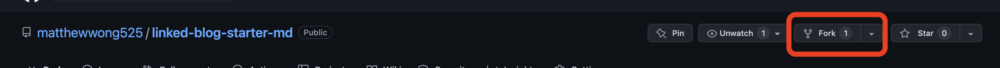
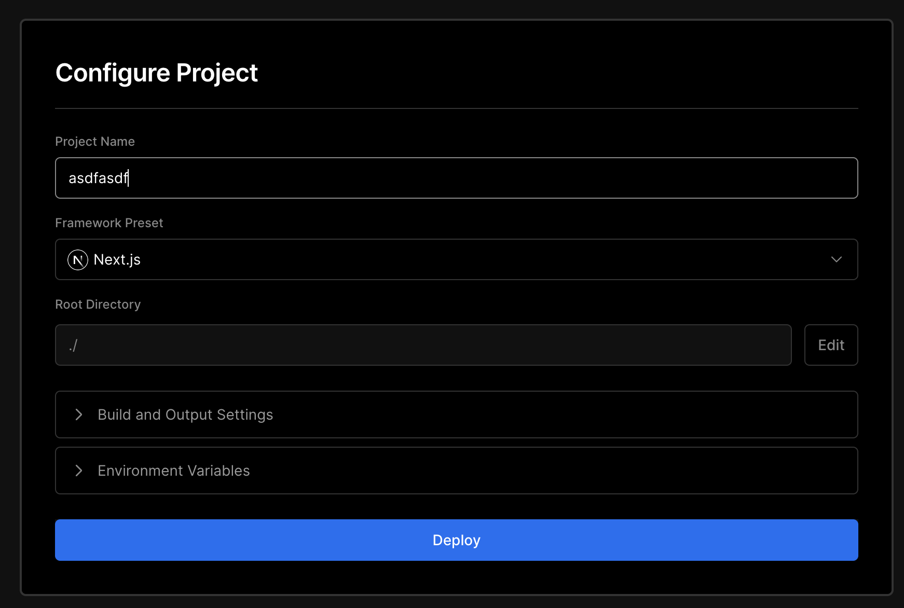
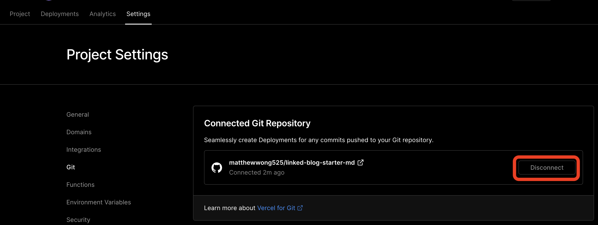
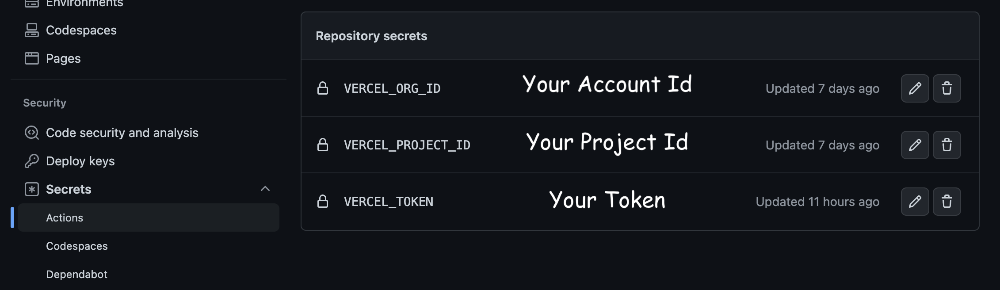
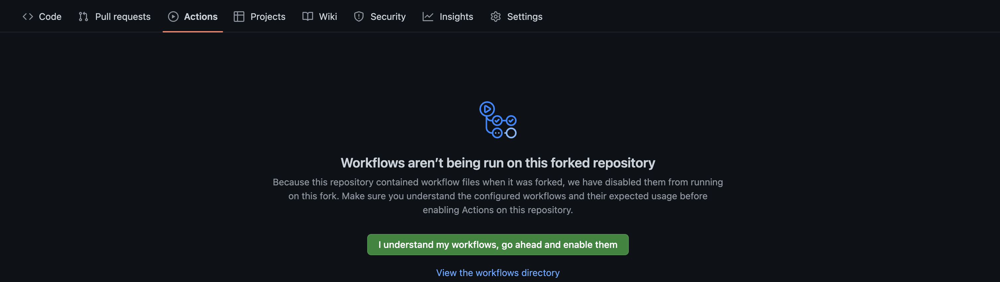

By the end of this tutorial, you'll have a github repository that will automatically publish notes to your custom website everytime you upload new notes to the `publish` folder.

## Step-by-step instructions to setup your blog

1. Fork the repository [linked-blog-starter-md](https://github.com/matthewwong525/linked-blog-starter-md) repository. This repository is where the publishing occurs
   
1. Create a [Vercel](https://vercel.com/dashboard) account then go to your dashboard then (Add New... > Project)
1. Import the repository you just forked
1. In the "Configure Project" settings (before you deploy), **set the "Framework Preset" to Next.JS** . Then click the "Deploy" button.
   
1. After clicking the Deploy button, you'll see that the deploy failed. That's as expected.
1. OPTIONAL: Go to your [dashboard](https://vercel.com/dashboard), then click on the project you created and disconnect the git repository (Settings > Git > Disconnect)
   
1. Then, [get the account id, project id and token from vercel](get-project-id-account-id-and-token-vercel.md)
1. Now with the account id, project id, and token, go back to your forked repository and update Github secrets (Settings > Secrets > Actions). Add the following secrets: `VERCEL_ORG_ID`, `VERCEL_PROJECT_ID`, `VERCEL_TOKEN`
   
1. Finally, click "Actions", and enable the workflow
   
1. Now whenever any notes are uploaded to the `publish` directory of the repository, they are automatically published online! You can find the domain in Vercel under `Projects`.

**Note**: Make sure you don't delete the `/publish/home.md` file as that is your "landing page"

Optionally, you can:

* [Publish Notes within your Obsidian Vault](connect-obsidian-vault-with-github.md) by installing the Obsidian Git plugin
* [Update the publish settings](update-publish-settings-github-actions.md) to publish your notes to a [custom version](deploy-a-custom-linked-blog-starter.md) of the linked-blog-starter
